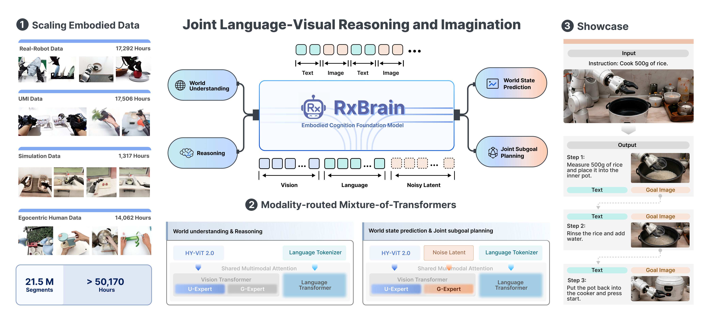

<div align="center">

# RxBrain: Embodied Cognition Foundation Model with Joint Language–Visual Reasoning and Imagination

<p align="center">
  <em>Tencent Robotics X&nbsp;&nbsp;×&nbsp;&nbsp;Futian Laboratory&nbsp;&nbsp;×&nbsp;&nbsp;Tencent Hy Team</em>
</p>

[](https://huggingface.co/tencent/Hy-Embodied-RxBrain-1.0)
[](./assets/RxBrain_v0.pdf)
[](./LICENSE)

<p align="center">
  
</p>

</div>

---

## 📌 Introduction

**RxBrain** (`Hy-Embodied-RxBrain-1.0`) is a **unified multimodal foundation model for embodied cognition** —
one model that delivers three core capabilities:

- 🤖 **Embodied Understanding & Reasoning** — question answering and chain-of-thought over images and multi-frame video.
- 🔮 **World State Prediction** — imagine the near-future frames an action produces in the physical world.
- 🧩 **Joint Subgoal Planning** — decompose a task into steps, emitting for each step *both* the next action (language) *and* the goal image it should reach (vision).

These capabilities are unified through **interleaved generation**: within a single autoregressive sequence
RxBrain alternates reasoning text and flow-matched imagined frames — a learned `<Image>` token decides when
to imagine — so an embodied plan couples *what to do* with *what the world should look like*, step by step.


---

## 📰 News

- **[2026-07]** 🎉 We release **Hy-Embodied-RxBrain-1.0** — the technical report, inference code and model weights.


---

## 🚀 Quick Start

### 1. Environment

```bash
git clone https://github.com/Tencent-Hunyuan/Hy-Embodied-RxBrain-1.0.git
cd Hy-Embodied-RxBrain-1.0
pip install -r requirements.txt
```

Requirements: **Python 3.10+**, a **CUDA GPU** (for `flash-attn`).


### 2. Download weights

| Model | Params | Download |
|---|:---:|---|
| **Hy-Embodied-RxBrain-1.0** | ~6.2 B | [🤗 tencent/Hy-Embodied-RxBrain-1.0](https://huggingface.co/tencent/Hy-Embodied-RxBrain-1.0) |
| FLUX VAE (`ae.safetensors`) | 83.8 M | Obtain from the [FLUX](https://github.com/black-forest-labs/flux) distribution |

### 3. Run inference

<details open>
<summary><b>① Text-to-Image (T2I)</b></summary>

```bash
python text2image_inference.py \
    --ckpt ./ckpts/rxbrain --vae /path/to/ae.safetensors \
    --prompt "a watercolor painting of a cat" \
    --height 256 --width 256 --num_steps 25 --out out.png

# with classifier-free guidance
python text2image_inference.py \
    --ckpt ./ckpts/rxbrain --vae /path/to/ae.safetensors \
    --prompt "a watercolor painting of a cat" \
    --cfg_scale 5.0 --num_steps 50 --out out.png
```
</details>


<details open>
<summary><b>② Multi-Frame World-Model Rollout</b> (4 future frames from an observation)</summary>

```bash
python multiframe_inference.py \
    --ckpt ./ckpts/rxbrain --vae /path/to/ae.safetensors \
    --frames /path/to/obs.jpg --task "imagine the next frames" \
    --num_frames 4 --num_steps 50 --out_dir multiframe_out
```
</details>

<details open>
<summary><b>③ Visual Question Answering (VQA)</b> (image(s) + question → answer text)</summary>


```bash
python vqa_inference.py \
    --ckpt ./ckpts/rxbrain \
    --images demo_cases/bridgev2_move_toy/input/obs_1.jpg \
    --question "What objects are on the stovetop, and where is the green toy?" \
    --max_new_tokens 256
```
</details>

<details open>
<summary><b>④ Run an Interleaved Embodied Planning on demo cases</b></summary>

Runs interleaved planning on a bundled scene. See [`demo_cases/README.md`](./demo_cases/README.md) for more details.

```bash
CASE=umi_fold_sock
python interleave_inference.py \
    --ckpt ./ckpts/rxbrain --vae /path/to/ae.safetensors \
    --frames  demo_cases/$CASE/input/*.jpg \
    --task    "$(cat demo_cases/$CASE/prompt.txt)" \
    --max_frames 5 --num_steps 50 --out_dir out_$CASE
```

</details>

---

## 📄 License

Released under **Apache License 2.0**. See [`LICENSE`](./LICENSE) for details.


